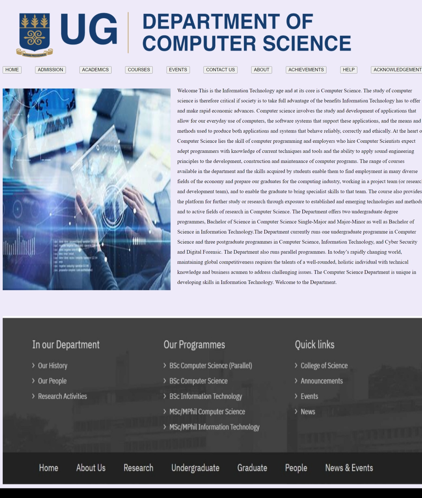
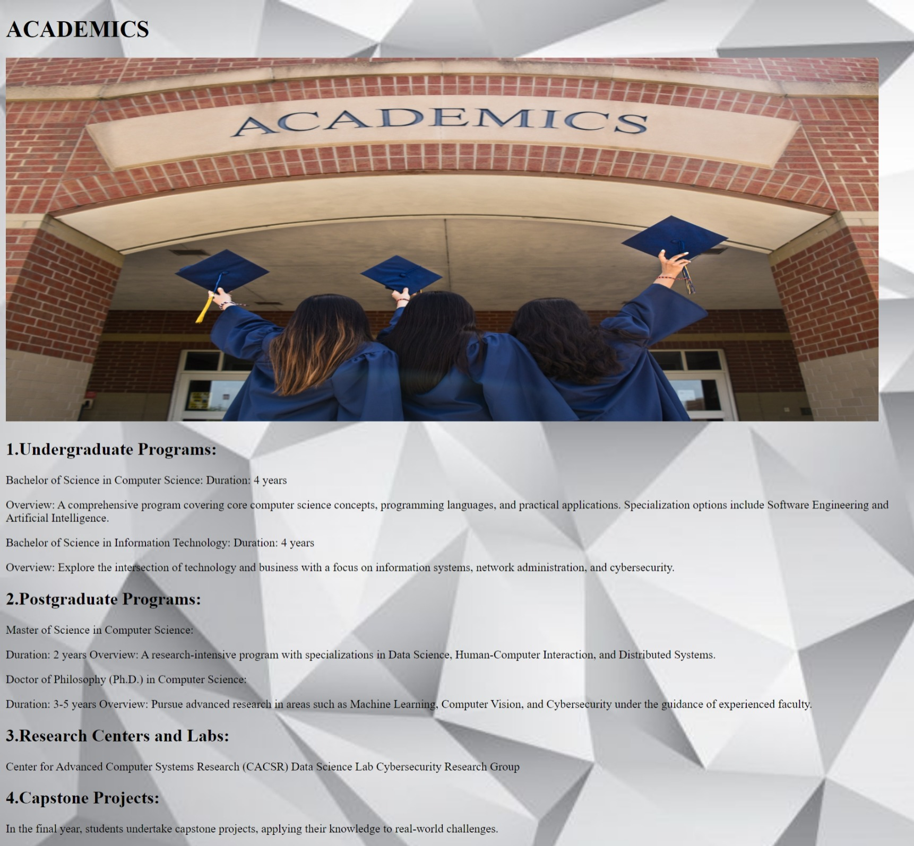
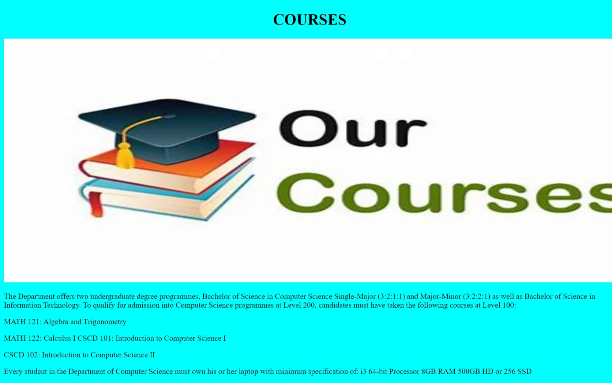
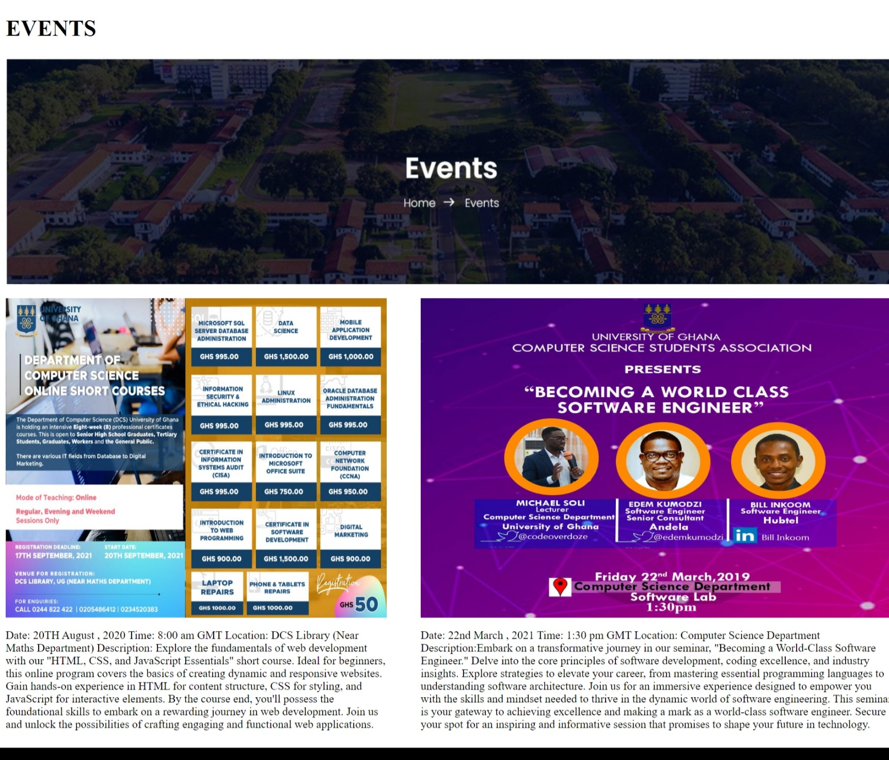
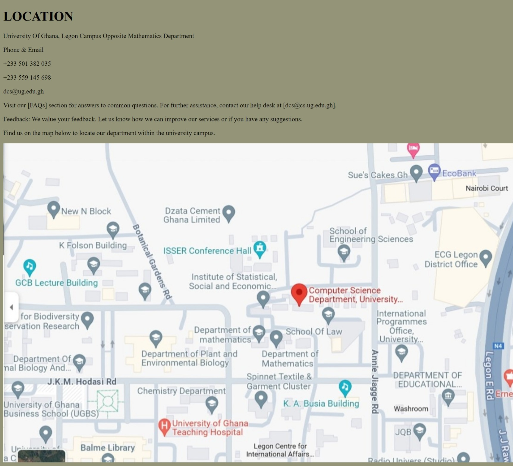
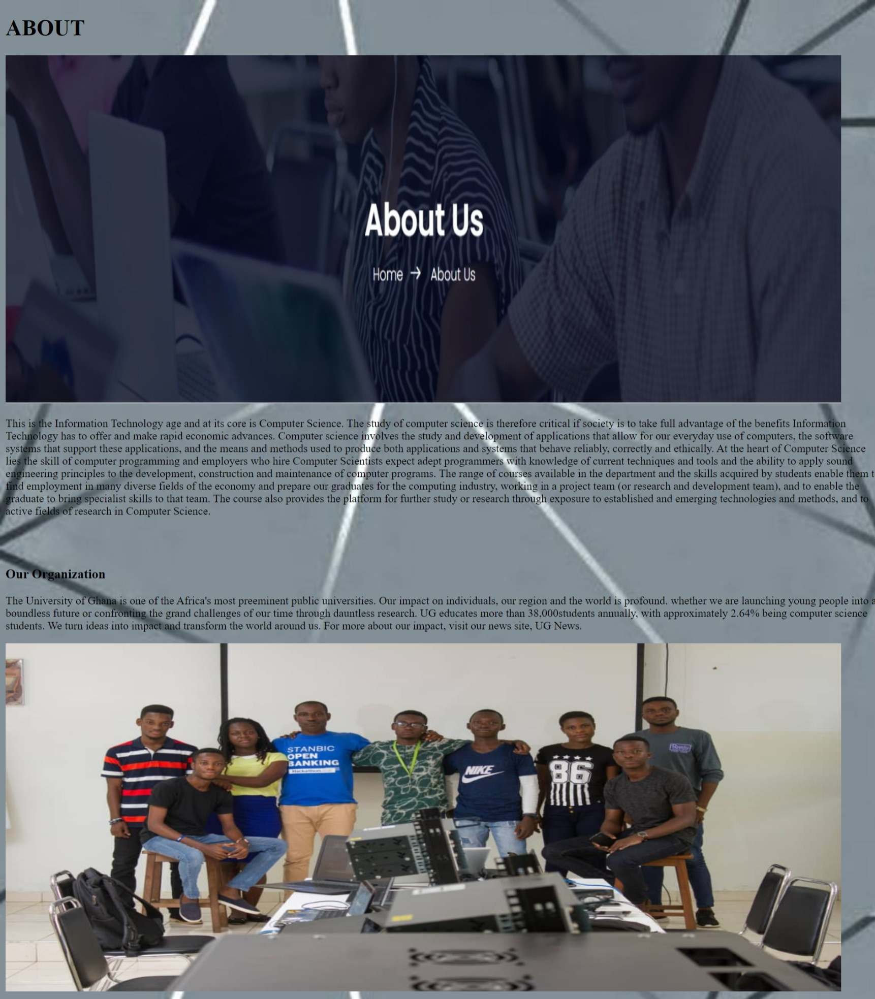
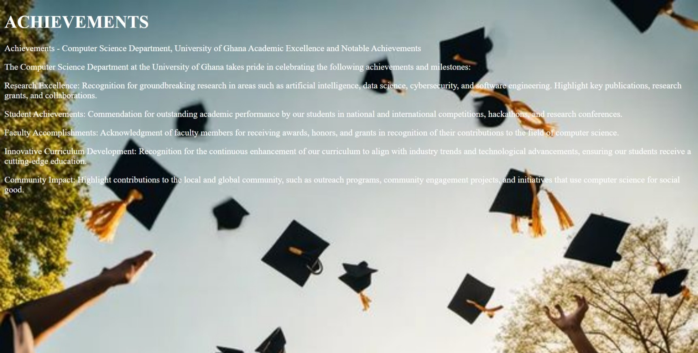
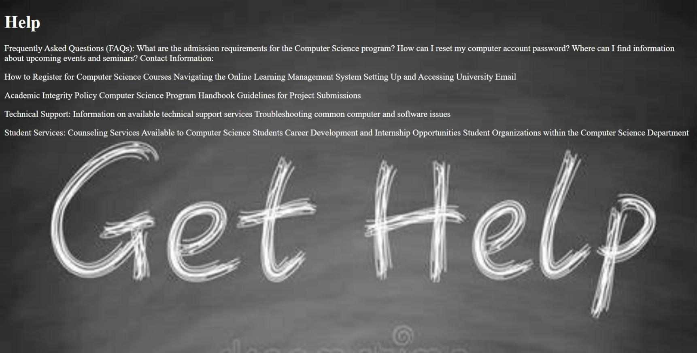
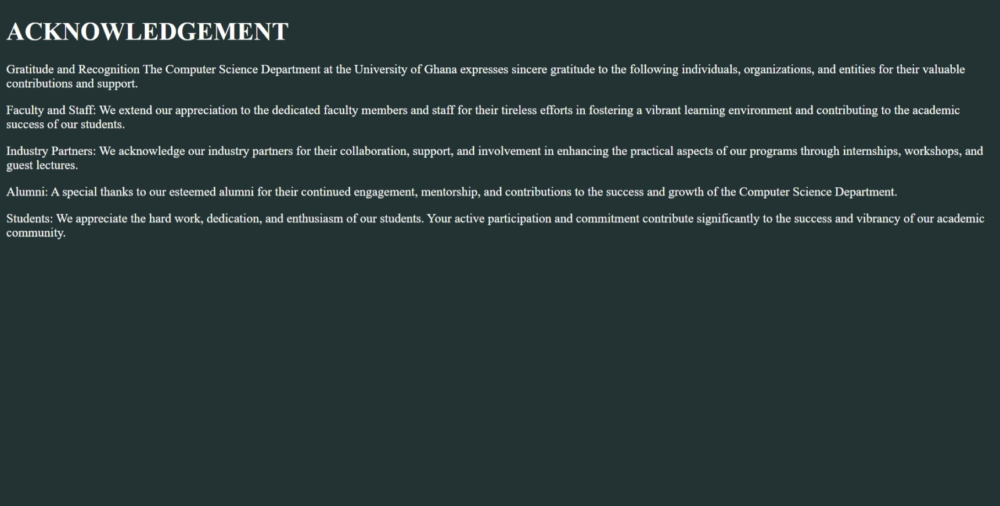

# DCIT_205_IA
11258525
# COMPUTER SCIENCE DEPARTMENT
# Introduction
This write up provides a 10 page website on the UG department of Computer SCience and its significant factors exploitedly stated

# The Purpose of Website
The purpose of the University of Ghana Computer Science Department website is to create a cohesive and accessible online space for our academic community. It serves as a central hub, providing essential information on departmental history, faculty, and courses. The site showcases our commitment to innovation through cutting-edge research centers and highlights the achievements of our faculty and alumni. Additionally, it offers resources, event calendars, and opportunities for collaboration, fostering a sense of community. With a user-friendly design, the website aims to enhance communication, showcase our expertise, and inspire the next generation of computing professionals within and beyond the University of Ghana.

# Technologies I Used 
  -CSS
  -HTML

#  Overview of Project
The purpose of the University of Ghana Computer Science Department website is to create a cohesive and accessible online space for our academic community. It serves as a central hub, providing essential information on departmental  faculty and courses. The site showcases our commitment to innovation through cutting-edge research centers and highlights the achievements of our faculty and alumni. Additionally, it offers resources, event calendars, and opportunities for collaboration, fostering a sense of community. With a user-friendly design, the website aims to enhance communication, showcase our expertise, and inspire the next generation of computing professionals within and beyond the University of Ghana.
 #  Structure  of  Website
 The website structure is meticulously designed to encompass essential facets of the University of Ghana Computer Science Department. It features dedicated sections for faculty, courses, resources, events, contact information and an additional customizable page. Each section is crafted to offer specific and pertinent information, ensuring a comprehensive and well-organized representation of the department's offerings and achievements.

 #  How to clone the project.
 Open your terminal or command prompt.

Use the git clone command followed by the URL of the project's repository to copy the project to your local machine.

Navigate to the project directory in your terminal using the cd command.

Install the necessary dependencies for the project, typically managed by a tool like npm.

Start the development server to preview the website.

Open your web browser and visit the provided local address to view the website.
 
 #  Screenshot
  
# Home

# Admission

# Academics

# Courses

# Events 

# Contact Us

# About

# Achievements 

# Help

# Acknowledgement

# What I Acquired from the project
Engaging in the Computer Science Department Website project enriched my skills across various domains. I honed my frontend development capabilities, mastering HTML, CSS, and React for creating engaging web interfaces. Embracing responsive design principles, I ensured the website's adaptability across diverse devices. Proficient Git usage facilitated version control and collaborative teamwork. The project cultivated organization skills, optimizing usability and user experience. Through addressing design, functionality, and integration challenges, I refined problem-solving abilities. Prioritizing a user-centric approach, I emphasized creating an intuitive interface. The comprehensive README showcased improved documentation proficiency, complementing enhanced project management insights gained from adhering to timelines and meeting requirements.

